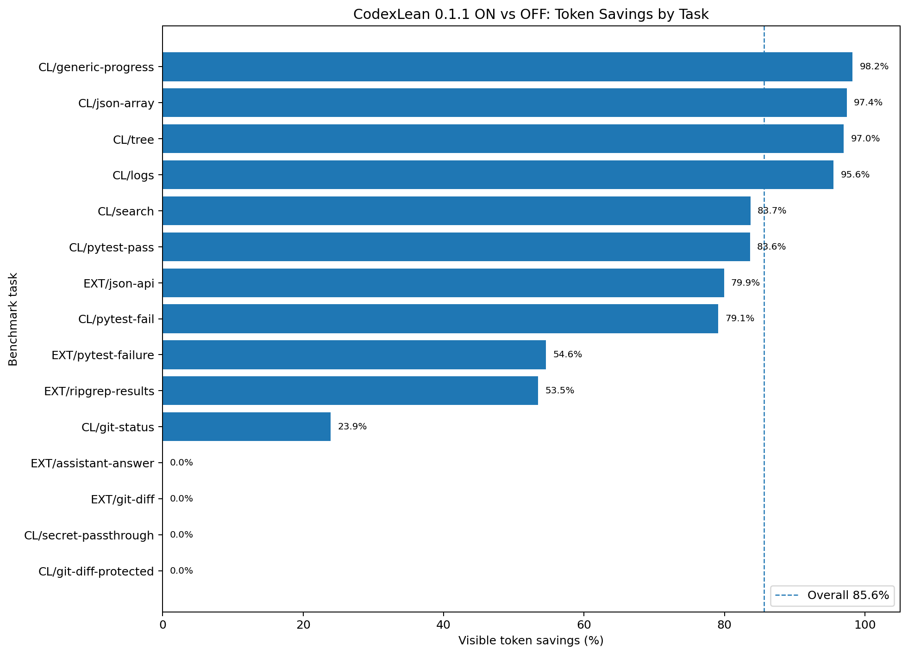
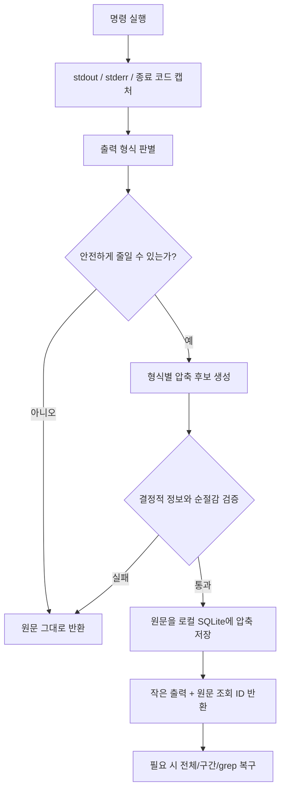
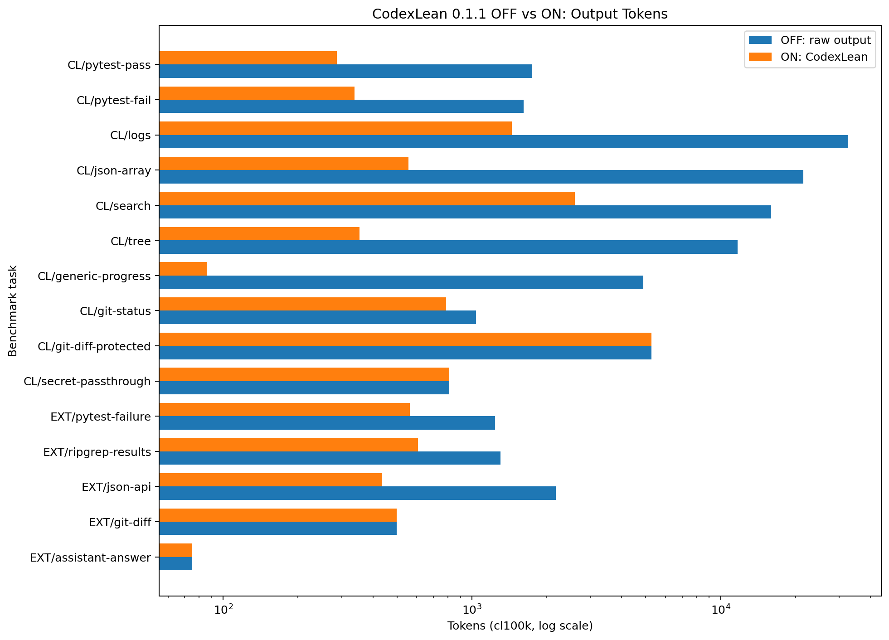

# CodexLean

Codex와 코딩 에이전트가 읽는 **긴 터미널 출력을 보수적으로 줄이고, 생략된 원문은 필요할 때 정확히 복구하는 로컬 토큰 절약 도구**입니다.

반복되는 테스트 성공 행, 대량 로그, JSON 배열, 검색 결과, 파일 트리, 진행률 출력은 형식별로 압축합니다. 반면 `git diff`, 민감정보 포함 출력, 짧은 출력처럼 손실 위험이 크거나 절감 효과가 없는 입력은 원문 그대로 통과시킵니다.

> 현재 버전: **0.2.0 Beta**
> 독립 오픈소스 유틸리티이며 OpenAI 공식 제품이 아닙니다.

## 핵심 결과

동일한 15개 합성 작업에서 기능 OFF와 `safe` 프로필 ON을 비교했습니다.

| 지표 | 결과 |
|---|---:|
| 기능 OFF | 102,489 tokens |
| CodexLean ON | 14,723 tokens |
| **가시 토큰 절감률** | **85.6%** |
| 엄격 1차 품질 게이트 | **15/15 통과** |
| 정확 원문 가용 | **15/15** |
| 실제 압축 | 11/15 |
| 안전상 원문 통과 | 4/15 |
| 민감정보 저장 위반 | 0건 |



> 위 결과는 정적 명령 출력 압축 계층의 합성 마이크로벤치마크입니다. 실제 Codex 세션 전체의 시스템 프롬프트, 캐시, 숨은 추론, 재시도 및 과금 토큰을 측정한 값은 아닙니다. 재현 데이터는 [`benchmarks/cross_results.md`](benchmarks/cross_results.md)에 있습니다.

## 동작 방식



1. 래핑된 명령을 직접 실행하고 출력과 종료 코드를 캡처합니다.
2. 테스트, 로그, JSON, 검색, 트리, Git 상태 등 출력 형식을 판별합니다.
3. 오류·경고·assertion·경로·요약 같은 결정적 정보를 우선 보존합니다.
4. 생략이 발생하면 전체 원문을 로컬 SQLite에 zlib 압축하여 저장합니다.
5. 압축 결과가 충분하지 않을 때 `codexlean show`로 전체 또는 필요한 구간만 조회합니다.
6. 형식 신뢰도가 낮거나 저장·품질 검사에 실패하면 정보 손실 없이 원문으로 폴백합니다.

## 플랫폼별 설치

루트의 플랫폼 폴더에 설치·제거 파일과 전용 안내를 분리했습니다. 압축 엔진은 루트 `src/`를 공동으로 사용하므로 Linux와 Windows의 동작이 갈라지지 않습니다.

| 플랫폼 | 설치 | 상세 안내 |
|---|---|---|
| Linux | `./linux/install.sh` | [`linux/README.md`](linux/README.md) |
| Windows | `.\windows\install.ps1` | [`windows/README.md`](windows/README.md) |

두 설치 프로그램 모두 전용 가상환경을 만들어 **시스템 Python을 변경하지 않습니다.**

### 요구 사항

- Python **3.10 이상**
- Linux 또는 Windows
- Codex 연동을 사용할 경우 Codex가 읽을 수 있는 `AGENTS.md` 및 `.agents/skills` 환경

### Linux — 권장

```bash
git clone https://github.com/hojunjeon/CodexLean.git
cd CodexLean
./linux/install.sh
```

### Windows PowerShell — 권장

```powershell
git clone https://github.com/hojunjeon/CodexLean.git
cd CodexLean
.\windows\install.ps1
```

설치 프로그램은 전용 가상환경에 패키지를 설치하고 사용자 범위 Codex Skill을 구성한 뒤 `doctor`를 실행합니다.

### 개발용 소스 설치

```bash
git clone https://github.com/hojunjeon/CodexLean.git
cd CodexLean
python3 -m pip install .
```

개발 환경:

```bash
python3 -m pip install -e '.[test,benchmark]'
pytest -q
```

## Codex 연동

### 사용자 전체에 적용

```bash
codexlean install --scope user
codexlean doctor --scope user
```

사용자 범위 설치는 다음을 구성합니다.

- `~/.agents/skills/codexlean`
- `~/.codex/AGENTS.md`의 관리 블록
- 기존 `AGENTS.md` 수정 전 `.codexlean.bak` 백업

### 특정 프로젝트에만 적용

```bash
codexlean install --scope project --project /path/to/repository
codexlean doctor --scope project --project /path/to/repository
```

프로젝트 루트의 `.agents/skills/codexlean`과 `AGENTS.md`만 변경합니다.

## 사용 예시

긴 출력이 예상되는 명령 앞에 `codexlean run --`을 붙입니다.

```bash
codexlean run -- pytest -q
codexlean run -- npm test
codexlean run -- cargo test
codexlean run -- rg "register_handler" src
codexlean run -- find . -type f
codexlean run -- sh -lc 'docker compose logs --no-color | tail -n 5000'
```

압축 결과 예시:

```text
[codexlean test; exit=1; lines=812->34; omitted=778 | exact: codexlean show 31c5f0d3c03e8db8]

FAILED tests/test_auth.py::test_expired_token_rejected
E AssertionError: expected 401, got 200
E at tests/test_auth.py:42
1 failed, 801 passed in 9.31s
```

### 원문 복구

```bash
# 전체 원문
codexlean show 31c5f0d3c03e8db8

# 특정 오류 주변만
codexlean show 31c5f0d3c03e8db8 --grep 'AssertionError' --context 5

# 특정 행 범위
codexlean show 31c5f0d3c03e8db8 --lines 180:240

# 앞/뒤 일부
codexlean show 31c5f0d3c03e8db8 --head 80
codexlean show 31c5f0d3c03e8db8 --tail 80

# 원시 바이트 복구
codexlean show 31c5f0d3c03e8db8 --raw > exact-output.bin
```

### 파이프 입력 압축

```bash
some-command | codexlean filter --command 'some-command' --exit-code 0
```

### 저장 데이터 관리

```bash
codexlean list
codexlean stats
codexlean stats --days 7 --json
codexlean purge --older-than 7
```

## 출력별 처리

| 출력 유형 | 기본 동작 |
|---|---|
| 테스트 성공 | 반복 성공 진행 행 축약, 최종 요약 보존 |
| 테스트 실패 | 실패 테스트, assertion, 예외, 파일 위치, 요약 보존 |
| 운영 로그 | 반복 템플릿 집계, 오류·경고·traceback 문맥 보존 |
| JSON | 구조적 샘플링, 첫·끝·오류 레코드와 핵심 수치 보존 |
| 검색 결과 | 경로 그룹화와 분산 샘플링, 오류 및 주요 `path:line` 보존 |
| 파일 트리 | 계층 재구성, 중복 prefix 제거, 핵심 프로젝트 파일 보존 |
| `git status` | 상태별 그룹화, 변경된 모든 경로 보존 |
| `git diff` | 기본적으로 원문 통과 |
| 진행률·반복 출력 | 반복 행과 터미널 재그리기 축약 |
| 민감정보 추정 출력 | 저장·압축하지 않고 원문 통과 |
| 짧은 출력 | 순절감이 없으면 원문 통과 |

## 프로필

| 프로필 | 동작 | 권장 용도 |
|---|---|---|
| `strict` | JSON 공백, 연속 중복 등 결정론적 표현 노이즈만 제거 | 가장 보수적인 환경 |
| `safe` | 형식별 압축, 정확 복구, 품질 가드 | **기본값** |
| `max` | 검색·트리·로그의 첫 화면 샘플을 더 줄임 | 컨텍스트 압박이 매우 큰 세션 |

```bash
codexlean run --profile strict -- pytest -q
codexlean run --profile safe -- npm test
codexlean run --profile max -- rg 'pattern' .
```

## 안전성 원칙

- 래핑한 명령의 종료 코드를 그대로 반환합니다.
- POSIX signal 종료는 `128 + signal`, 타임아웃은 `124`, 사용자 중단은 `130`을 사용합니다.
- 비정상 종료에서 감지된 오류·예외·assertion·실패 테스트명·파일 위치를 검사합니다.
- 생략된 원문을 정확히 저장할 수 없으면 압축을 취소합니다.
- 압축 헤더와 복구 안내까지 포함했을 때 실제 순절감이 없으면 원문을 반환합니다.
- `api_key`, `token`, `password`, `authorization`, PEM private key 및 일반적인 PAT 형태가 감지되면 기본적으로 저장하지 않습니다.
- `git diff`는 코드 의미 손실 위험 때문에 원문을 유지합니다.
- 네트워크 전송과 원격 telemetry를 사용하지 않습니다.

## 로컬 데이터

기본 원문 저장 위치:

- Linux: `~/.cache/codexlean/artifacts.sqlite3`
- Windows: `%LOCALAPPDATA%\CodexLean\artifacts.sqlite3`

특성:

- zlib 압축
- SHA-256 무결성 검사
- Unix 환경에서 디렉터리 `0700`, DB `0600` 권한 시도
- 기본 보존 기간 7일
- 자체 암호화는 제공하지 않음

민감 저장소에서는 암호화된 볼륨을 지정할 수 있습니다.

```bash
export CODEXLEAN_STORE=/encrypted/path/codexlean.sqlite3
export CODEXLEAN_RETENTION_DAYS=1
```

민감 출력 저장을 명시적으로 허용하려면 다음 환경변수를 사용하지만 권장하지 않습니다.

```bash
export CODEXLEAN_STORE_SECRETS=1
```

## 벤치마크 재현

### 내장 10개 코퍼스

```bash
codexlean benchmark --output benchmarks/results.md
```

### 확장 15개 ON/OFF 교차 코퍼스

```bash
python3 -m pip install -e '.[benchmark]'
python3 benchmarks/cross_benchmark.py
```

산출물:

- [`benchmarks/cross_results.md`](benchmarks/cross_results.md)
- [`benchmarks/cross_results.csv`](benchmarks/cross_results.csv)
- [`benchmarks/cross_results.json`](benchmarks/cross_results.json)



## 검증 범위와 한계

- Python 3.11/Linux에서 자동 테스트 **38개**와 격리 설치→실행→제거 smoke test를 통과했습니다.
- GitHub Actions는 Python 3.10/3.13의 Linux·Windows 테스트와 두 플랫폼 설치 smoke test를 실행합니다.
- Wheel 설치, CLI 버전, Codex Skill 설치·진단, 명령 종료 코드, 부분 타임아웃 출력, 원문 바이트 복구를 검증합니다.
- 15개 교차 코퍼스에서 엄격 1차 품질 게이트 **15/15**, 정확 원문 가용 **15/15**를 확인했습니다.
- 합성 벤치마크 통과가 모든 저장소와 미래 작업의 무회귀를 증명하지는 않습니다.
- 인증된 실제 Codex 유료 세션의 provider-reported token A/B 또는 SWE-bench 종단 간 비열화 실험은 포함하지 않았습니다.
- CodexLean은 API 요청, 시스템 프롬프트, 대화 이력 전체를 프록시에서 재작성하지 않습니다. 현재 범위는 주로 명령 출력 계층입니다.
- 원문 저장소는 로컬이지만 자체 암호화되지 않습니다.

## 제거

Linux:

```bash
./linux/uninstall.sh
```

Windows PowerShell:

```powershell
.\windows\uninstall.ps1
```

플랫폼 설치 프로그램을 사용하지 않은 개발용 설치는 `codexlean uninstall --scope user` 후 해당 Python 환경에서 `python -m pip uninstall codexlean`으로 제거합니다.

## 프로젝트 구조

```text
linux/                Linux 설치·제거 및 사용 안내
windows/              Windows 설치·제거 및 사용 안내
src/codexlean/       핵심 엔진, 필터, 저장소, CLI
skills/codexlean/    Codex Skill 원본
benchmarks/          내장·교차 벤치마크와 결과
tests/               자동 테스트
docs/                설계, 연구, 검증 문서와 차트
```

## 참고한 설계 패턴

소스 코드를 복사하지 않고 다음 공개 프로젝트의 설계 패턴을 참고했습니다.

- [Caveman](https://github.com/juliusbrussee/caveman): 불필요한 응답 문구 축소
- [RTK](https://github.com/rtk-ai/rtk): 명령별 출력 필터링
- [Headroom](https://github.com/headroomlabs-ai/headroom): 가역형 Compress–Cache–Retrieve

자세한 조사 및 채택 범위는 [`docs/RESEARCH.md`](docs/RESEARCH.md)에 기록했습니다.

## 라이선스

[Apache License 2.0](LICENSE)
